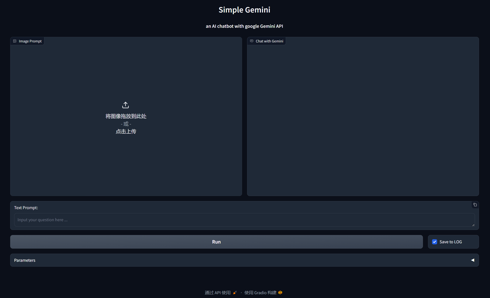
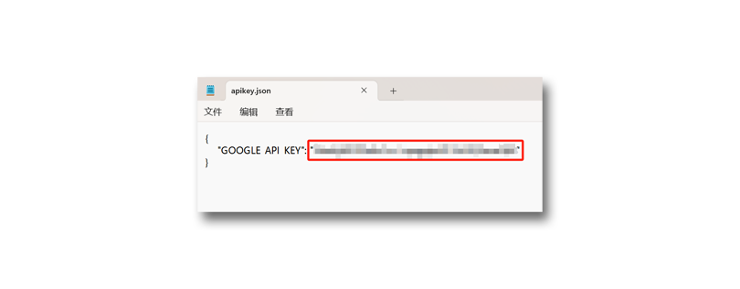

# SimpleGemini

[中文说明点这里](./README_CN.MD)

SimpleGemini is an interactive AI chat WebApp based on [Gradio](https://www.gradio.app/), It conducts real-time conversations through Google Gemini Pro and Gemini Pro Vision API, supporting text and image prompts.   

To use this program, you need to be able to access Google's network environment normally and apply for an API key in advance in [Google AI Studio](https://makersuite.google.com/app/apikey).    

This project is a modified version of the [meryemsakin/GeminiGradioApp](https://github.com/meryemsakin/GeminiGradioApp), which adds the function of saving conversations<sup>*</sup>.


<sup>*</sup>Chat records will not be uploaded and will be saved in a date named subfolder under the local user folder(be like C:\user\username\.simplegemini\log), including text and images.    

The record file is not encrypted, please pay attention to privacy and security. The images in chat history have been reduced to a thumbnail of no more than 512x512 pixels to save disk space, but after a lot of conversations, it may still take up a lot of space. Please clean it regularly.

There is a "Save to LOG" checkbox in the bottom right corner of the WebApp, which is checked by default. If unchecked, the current chat record will not be saved.



### Install

An integration package is provided on [Baidu Netdisk](https://pan.baidu.com/s/1DBilb4ZU3keQ8NG7MYhSIQ?pwd=gad9), and after downloading, you only need to set the API key to use it.

* Download the ```SimpleGemini_portable.rar``` and unzip it.  
* Find the ```SimpleGemini\apikey.json```, Open this file using text editing software (such as Notepad), fill in your Google API key in the double quotation marks after "GOOGLE-API_KEY" on the second line, and save the file.

* Find ```SimpleGemini\run_gemini_python_embeded.bat```, Double click to run. Please ensure that your network environment can use Gemini normally.


The manual deployment method is as follows. The installation instructions are only for Windows, please refer to the deployment for other platforms.

* Firstly, confirm that Python version 3.10 or above is installed.

* Open the terminal and use the following command to clone this repository:
```
git clone https://github.com/chflame163/SimpleGemini.git
```
* Enter the project directory:
```
cd SimpleGemini
```
* Create venv:
```
python.exe -m venv venv 
```
* Install the project dependency package for venv:
```
.\venv\Scripts\python.exe -m pip install -r .\requirements.txt
```
* Close the terminal window. Find ```SimpleGemini\run_gemini_python_embeded.bat```, Double click to run. Please ensure that your network environment can use Gemini normally.


* Installation completed, Find ```SimpleGemini\run_gemini_venv.bat```, Double click to run. Please ensure that your network environment can use Gemini normally.
