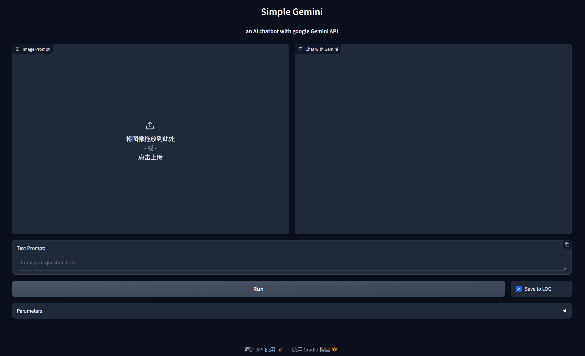
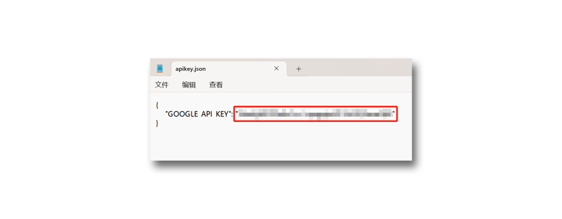

# SimpleGemini


SimpleGemini 是一个基于[Gradio](https://www.gradio.app/)的交互式AI聊天WebApp, 它通过Google Gemini Pro和Gemini Pro Vision API进行实时对话， 支持文本和图片prompt。使用这个程序需要可以正常访问Google的网络环境， 并预先在[Google AI Studio](https://makersuite.google.com/app/apikey)申请API key。  

本项目是[meryemsakin/GeminiGradioApp](https://github.com/meryemsakin/GeminiGradioApp)的修改版，在其基础上增加了保存对话<sup>*</sup>的功能。   

<sup>*</sup>聊天记录不会被上传，保存在本地用户文件夹(例如C:\user\username)\.simplegemini\log文件夹下以日期命名的子文件夹中，包括文字和图片。

聊天记录文件没有加密，请注意隐私安全。聊天记录中的图片被缩小到不超过512x512像素的预览图以节省磁盘空间，但是经过大量的对话后，仍然可能占用很多空间，请定时清理。

App右下角有"Save to LOG"复选框，默认是勾选状态。如果取消勾选，当前这条聊天记录不会被保存。



### 安装

在[百度网盘](https://pan.baidu.com/s/1DBilb4ZU3keQ8NG7MYhSIQ?pwd=gad9)提供了整合包, 下载后只需要设置API-key即可使用。
* 下载整合包然后解压。  
* 找到```SimpleGemini\apikey.json```，用文本编辑软件(例如记事本)打开这个文件，在第二行"GOOGLE_API_KEY": 后面的双引号""内填入你的Google API key, 并保存文件。

* 找到```SimpleGemini\run_gemini_python_embeded.bat```，双击运行。注意请确保你的网络环境可以正常使用Gemini。


手动部署方法如下，安装说明仅针对Windows，其他平台请自行参照部署。

* 首先确认安装了Python 3.10以上版本。

* 打开终端，用以下命令克隆这个仓库:
```
git clone https://github.com/chflame163/SimpleGemini.git
```
* 进入项目目录:
```
cd SimpleGemini
```
* 创建venv:
```
python.exe -m venv venv 
```
* 为venv安装本项目依赖包:
```
.\venv\Scripts\python.exe -m pip install -r .\requirements.txt
```
* 关闭终端窗口。在资源管理器中找到```SimpleGemini\apikey.json```，用文本编辑软件(例如记事本)打开这个文件，在第二行"GOOGLE_API_KEY": 后面的双引号""内填入你的Google API key, 并保存文件。


* 安装完成，找到```SimpleGemini\run_gemini_venv.bat```，双击运行。注意请确保你的网络环境可以正常使用Gemini。
